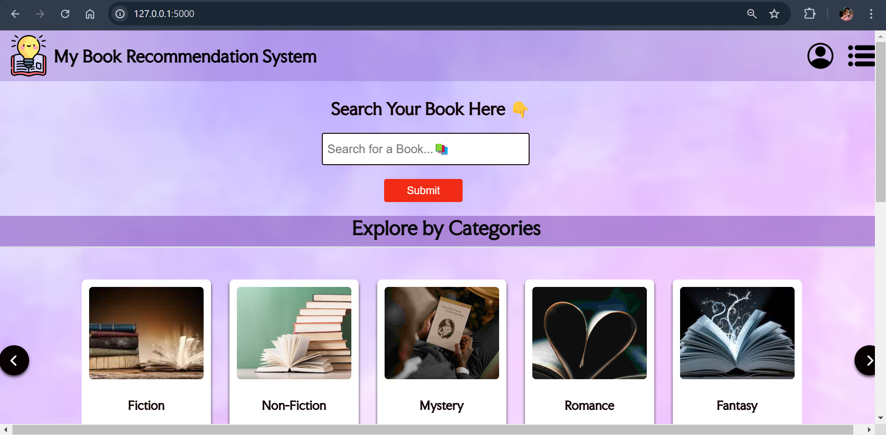

# Book Recommendation System 📚 

A smart and simple machine learning project that recommends books based on similarity scores. Built using Python and Flask.  
This Book Recommendation System helps users discover new books similar to the ones they like. It uses collaborative filtering techniques and pre-trained data for accurate and fast recommendations.

---

## ✨ Overview

- 👩‍💻 Developed in Python using Flask for web backend
- 📦 Uses pre-processed `.pkl` files for fast response
- 📸 Screenshot previews available in the `Preview/` folder
- 💡 Ideal for ML learners and portfolio projects

---

## 🔥Key Features

- 📖 Book recommendation system
- ⚡ Fast predictions using pre-trained data
- 💻 Simple and clean web interface
- 🎯 Personalized suggestions based on similarity scores

---

## 🛠 Tech Stack

- **Python** (Core Logic)
- **Flask** (Web Framework)
- **HTML/CSS** (Frontend templates)
- **Pickle** (Model/Data Storage)
- **Bootstrap** (UI Styling)

---

## 📸 Screenshots

You can find all screenshots in the `Preview/` folder.

> For demo video: `Preview/Recording.mp4`  

### 🏠 Home Page

### 📚 Recommendation Page

---

## 💬 Like the project?

If you found this helpful:

- ⭐ Star this repo
- 🍴 Fork it to improve
- 🐛 Report issues
- 🤝 Connect with me below

---

## 👩‍💻 Author

**Sandhya Kishorbhai Rana**  
🔗 GitHub: [@Sandhya-1401](https://github.com/Sandhya-1401)

---

## 📃 License

This project is for educational purposes only.
