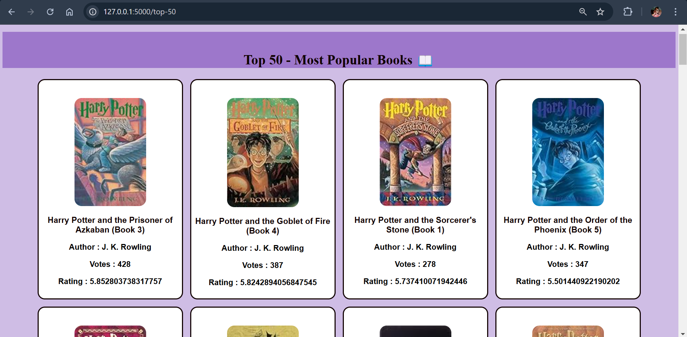

# Book Recommendation System 📚 

A smart and simple machine learning project that recommends books based on similarity scores. Built using Python and Flask.  
This Book Recommendation System helps users discover new books similar to the ones they like. It uses collaborative filtering techniques and pre-trained data for accurate and fast recommendations.

---

## ✨ Overview

- Developed in Python using Flask for web backend
- Uses pre-processed `.pkl` files for fast response
- Screenshot previews available in the `Preview/` folder
- Ideal for ML learners and portfolio projects

---

## 🔥Key Features

🔹 Book recommendation system  
🔹 Fast predictions using pre-trained data  
🔹 Simple and clean web interface  
🔹 Personalized suggestions based on similarity scores

---

## 🛠 Tech Stack

- **Frontend:** HTML, CSS (via Flask templates)
- **Backend:** Python, Flask
- **Data Processing:** Pandas, NumPy, Pickle
- **Model Storage:** Pre-trained `.pkl` files
- **Version Control:** Git & GitHub

**🎯 Why This Matters?**

- Book lovers often struggle to find what to read next.
- Many recommendation systems are behind paywalls or login screens.
- This project provides a simple, open-source, and effective way to get personalized book suggestions.
- Perfect for beginners in ML or web dev to understand recommendation systems.

---

## 📸 Screenshots

You can find all screenshots in the `Preview/` folder.

> For demo video: `Preview/Recording.mp4`  

### 🏠 Home Page

### 📚 Recommendation Page

### 📖 Top Books Page

---

## 📬 Contact

Created by **Sandhya** | [LinkedIn](https://www.linkedin.com/in/rana-sandhya) | [Github](https://github.com/Sandhya-1401)  
For any queries or collaborations, feel free to connect.  

### ⭐ **If you like this project, don’t forget to Star it on GitHub !!** ⭐  
